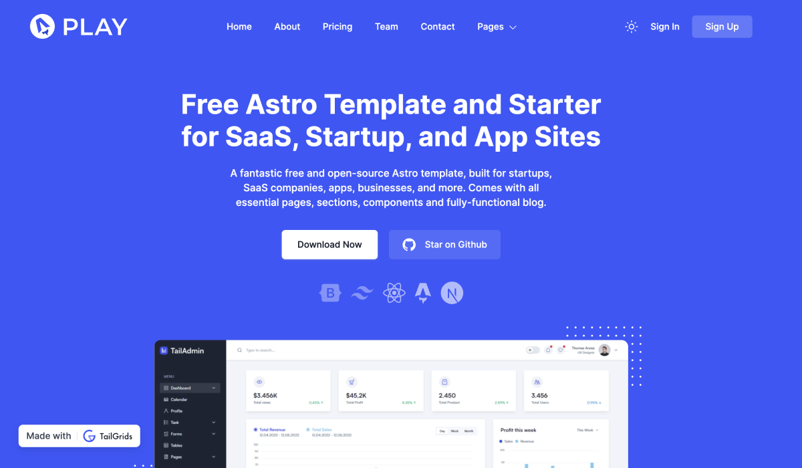

          
# Play Astro - 免费的Astro模板，适用于初创公司、SaaS和应用程序网站

## 简介
Play Astro 是一个出色的免费开源 Astro 模板，专为初创公司、SaaS 企业、应用程序和各类商业项目打造。凭借其优质的设计以及丰富的组件和页面，它是搭建完整网站的一站式解决方案。

### 技术栈 🥞
Play Astro 使用 [TailGrids](https://tailgrids.com/) UI 组件和 Tailwind CSS 构建，是一个高质量的 Astro + Tailwind CSS 启动模板。

### [🚀 查看演示](https://play-astro.tailgrids.com/)



## 功能特点
### 多场景适配 ✍️
该模板专为初创公司、SaaS 和应用程序网站设计，包含启动一个完整商业网站所需的所有必要部分、页面和组件，适合想要快速搭建强大在线平台的开发者。

### 强大的 Markdown 博客系统 ✍️
支持 Markdown 的博客系统，为运营完整的商业网站提供了一切必要功能。

### 技术整合 ✅
- **Astro**：现代静态网站生成器。
- **Tailwind CSS**：实用类优先的 CSS 框架。
- **TailGrids**：提供优质的 UI 组件。

## 项目结构
```plaintext
├── .astro/                  # Astro 生成的类型定义
├── .vscode/                 # VS Code 配置
│   ├── extensions.json      # 推荐的扩展
│   └── launch.json          # 调试配置
├── public/                  # 静态资源
│   ├── assets/              # 图片资源
│   ├── favicon.ico          # 网站图标
│   └── ...                  # 其他静态文件
├── src/                     # 源代码
│   ├── components/          # 可复用组件
│   ├── content/             # 内容文件
│   ├── layouts/             # 页面布局
│   ├── pages/               # 页面文件
│   ├── scripts/             # JavaScript 脚本
│   └── utils/               # 工具函数
├── .gitignore               # Git 忽略文件配置
├── astro.config.mjs         # Astro 配置文件
├── package.json             # 项目依赖和脚本配置
├── tailwind.config.cjs      # Tailwind CSS 配置
└── tsconfig.json            # TypeScript 配置
```

## 安装与部署
所有命令都在项目根目录的终端中运行：

| 命令                   | 作用                                           |
| :--------------------- | :--------------------------------------------- |
| `npm install`          | 安装项目依赖                                   |
| `npm run dev`          | 启动本地开发服务器，访问地址 `localhost:4321` |
| `npm run build`        | 构建生产环境代码到 `./dist/` 目录              |
| `npm run preview`      | 本地预览构建后的代码                           |
| `npm run astro ...`    | 运行 CLI 命令，如 `astro add`, `astro check`   |
| `npm run astro -- --help` | 获取 Astro CLI 使用帮助                     |

## 项目配置
### 开发配置
- **`.gitignore`**：定义了需要忽略的文件和目录，如构建输出、依赖项等。
- **`.prettierrc`**：Prettier 代码格式化配置，使用单引号、尾随逗号等。
- **`astro.config.mjs`**：Astro 项目配置，集成了 Tailwind CSS 和压缩插件。
- **`tailwind.config.cjs`**：Tailwind CSS 配置，定义了屏幕尺寸、容器、颜色和阴影等。
- **`tsconfig.json`**：TypeScript 配置，继承自 `astro/tsconfigs/strict`。

### 依赖配置
#### 生产依赖
- `@astrojs/tailwind`：Astro 的 Tailwind CSS 集成。
- `@fontsource-variable/inter`：可变字体。
- `astro`：现代静态网站生成器。
- `astro-compress`：Astro 压缩插件。
- `swiper`：轮播图组件库。
- `tailwindcss`：实用类优先的 CSS 框架。

#### 开发依赖
- `prettier`：代码格式化工具。
- `prettier-plugin-astro`：Astro 的 Prettier 插件。
- `prettier-plugin-tailwindcss`：Tailwind CSS 的 Prettier 插件。

## 主要组件和页面
### 组件
- **Aboutsection.astro**：关于页面部分
- **Blogsection.astro**：博客部分
- **CTAsection.astro**：行动号召部分
- **Card.astro**：卡片组件
- **Clients.astro**：客户展示组件
- **Contactsection.astro**：联系页面部分
- **Faq.astro**：常见问题组件
- **Features.astro**：功能特性部分
- **Formbox.astro**：表单组件
- **Hero.astro**：首页横幅组件
- **Newsletterbox.astro**：新闻订阅组件
- **Pagination.astro**：分页组件
- **PopularArticles.astro**：热门文章组件
- **Pricingsection.astro**：价格部分
- **RelatedArticles.astro**：相关文章组件
- **Team.astro**：团队介绍部分
- **Testimonials.astro**：客户评价部分

### 页面
- **index.astro**：首页
- **about.astro**：关于页面
- **blog.astro**：博客列表页面
- **contact.astro**：联系页面
- **pricing.astro**：价格页面
- **signin.astro**：登录页面
- **signup.astro**：注册页面
- **404.astro**：404 页面

## 许可证 📄
Play Astro 是一个开源模板，你可以自由地将其用于个人和商业项目，无需任何归属声明或反向链接。

## 支持项目 💖
- 给项目点个 Star ⭐。
- 与朋友分享该项目。
- 如果你遇到任何 bug，请提交 issue。
- 如果你修复了问题或认为可以为项目增加价值，欢迎提交 pull request。

## 了解更多 👀
欢迎查阅 [我们的文档](https://tailgrids.com/astro) 或加入 [Discord 服务器](https://pimjo.com/discord) 参与讨论。

        